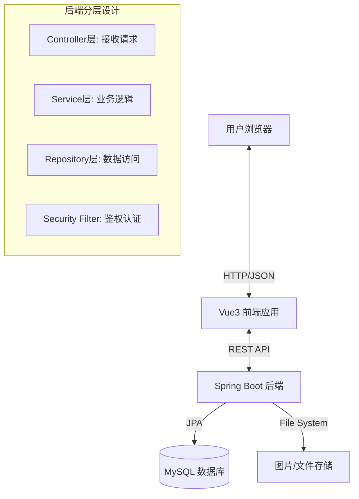

# 📔 Diary Space - 你的专属日记与树洞社区

> **课程名称**：高级程序设计
> **作业题目**：作业3 - 自由命题的Web应用

## 项目简介 

**Diary Space** 是一个基于前后端分离架构的现代化 Web 应用。它不仅是一个记录生活的私密日记本，更是一个具备社交属性的情感树洞。

本项目旨在打破传统日记应用的“单机”模式，创新性地引入了 **“半私密交换 ”** 机制和 **“匿名树洞”** 功能，并通过 **RPG式的经验值与成就系统** 激励用户持续记录与互动。

本项目完全满足作业要求：
- 使用 Java (Spring Boot) 开发后端 RESTful API。
- 使用 Vue.js 3 开发前端客户端。
- 使用 MySQL 数据库存储数据。
- 包含完整的增、删、改、查 (CRUD) 操作。
- 具备完善的错误处理与全局异常拦截。

---

## 核心功能与设计亮点 

### 1. 多维度的日记管理
用户可以撰写富文本日记，支持上传图片。最重要的是，日记设有三种可见性级别，逻辑实现严密：
- **私密 (Private)**: 仅自己可见。
- **公开 (Public)**: 出现在“发现广场”，所有人可见，支持搜索。
- **半私密 (Semi-Private)**: 这是一个**创新设计**。此类日记默认不可见，仅用于“交换”。用户可以向他人发起交换申请，若对方接受，双方即可查看对方用于交换的那篇特定日记。

### 2. 树洞问答社区 
一个温暖的互助社区：
- **提问**: 用户可以发布困惑或问题（支持匿名）。
- **回答**: 其他用户可以解答问题（支持匿名）。
- **互动**: 实时统计回答数量，区分“我的提问”与“热门问题”。

### 3. 游戏化成长体系 
为了增加用户粘性，系统内置了成长模块：
- **经验值 (XP)**: 发布日记、评论、点赞、交换成功均可获得经验值。
- **等级系统**: 经验值积累自动升级，个人主页展示炫酷进度条。
- **成就勋章**: 达成特定条件（如“初次交换”、“日记达人”）自动解锁成就徽章。

### 4. 安全与社交
- **JWT 认证**: 基于 Token 的无状态认证机制，安全高效。
- **社交互动**: 支持对公开日记进行点赞、评论。
- **消息中心**: 集中处理收到的交换请求，支持“接受/拒绝”操作。

---

## 技术栈 

### 前端 (Frontend)
- **核心框架**: Vue.js 3 (Composition API / Script Setup)
- **构建工具**: Vite
- **路由管理**: Vue Router 4
- **HTTP 客户端**: Axios (封装拦截器，自动注入 Token)
- **UI 样式**: 原生 CSS3, Flex/Grid 布局, 响应式设计

### 后端 (Backend)
- **开发语言**: Java 17+
- **核心框架**: Spring Boot 3.x
- **安全框架**: Spring Security (RBAC模型 + JWT Filter)
- **持久层**: Spring Data JPA (Hibernate)
- **数据库**: MySQL 8.0
- **工具库**: JJWT (Token处理), Lombok (简化代码)

---

## 系统架构 

项目采用经典的前后端分离架构，通过 RESTful API 进行通信。


### **目录结构概览**
```Plaintest
/src
├── /main/java/com/diaryweb/demo
│   ├── /config         # 配置类 (Security, WebMvc, InitData)
│   ├── /controller     # RESTful API 控制器
│   ├── /service        # 业务逻辑层 (Auth, Diary, Exchange, QnA...)
│   ├── /repository     # JPA 数据访问层
│   ├── /entity         # 数据库实体 (User, Diary, Comment...)
│   ├── /dto            # 数据传输对象 (UserDTO, DiaryDTO...)
│   ├── /security       # JWT 工具与过滤器
│   ├── /common         # 全局异常处理与统一响应 (ApiResponse)
│   └── /handler        # 全局异常拦截器
├── /src (Frontend)
│   ├── /api            # Axios API 接口定义
│   ├── /components     # 公共组件 (DiaryEditor, ExchangeModal...)
│   ├── /layout         # 布局组件 (Sidebar, Layout)
│   ├── /views          # 页面视图 (Home, Login, Profile, TreeHole...)
│   ├── /router         # 路由配置
│   └── /utils          # 工具函数 (request.js)
```
### **安全架构**
- **认证:** 用户登录后获取 Bearer Token，前端存储在 localStorage。
- **鉴权:** 后端 JwtAuthenticationFilter 拦截请求，解析 Token 并构建 SecurityContext。
- **异常处理:** RestAuthEntryPoint 和 RestAccessDeniedHandler 处理 401/403 错误，返回统一 JSON 格式。

### **数据库设计**
主要实体包括：
- **User:** 用户基础信息。
- **UserExperience / UserAchievement:** 用户等级与成就（一对一/一对多）。
- **Diary:** 日记主体，包含 Visibility 枚举。
- **DiaryExchange:** 记录交换的发起者、接收者、交换状态及涉及的日记 ID。
- **Question / Answer:** 树洞问答数据。
- **Comment / DiaryLike:** 社交互动数据。
---

## **接口概览**

### **1. 用户认证**
| 方法 | 接口路径               | 描述|
|------|------------------------|-----------------------------------|
| POST | `/api/auth/register`   | 用户注册 (用户名、密码、邮箱)     |
| POST | `/api/auth/login`      | 用户登录 (返回 JWT Token)         |

### **2. 用户管理**
| 方法 | 接口路径                                | 描述                                      |
|------|-----------------------------------------|-------------------------------------------|
| GET  | `/api/users/me`                         | 获取当前登录用户的完整个人资料 (含等级、经验) |
| GET  | `/api/users/{userId}/public-profile`    | 获取任意用户的公开资料 (用于查看他人主页)    |
| PUT  | `/api/users/{userId}`                   | 更新个人信息 (头像、简介、密码等)           |
| POST | `/api/users/upload/avatar`              | 上传用户头像 (返回图片 URL)                |
| GET  | `/api/users/{userId}/achievements`      | 获取指定用户的成就勋章列表                 |

### **3. 日记核心**
| 方法   | 接口路径                          | 描述                                                  |
|--------|-----------------------------------|-------------------------------------------------------|
| POST   | `/api/diaries/create`             | 创建纯文本日记                                        |
| POST   | `/api/diaries/createWithImage`    | 创建带图片的日记 (支持 MultipartFile)                 |
| PUT    | `/api/diaries/{diaryId}`          | 修改日记内容或可见性                                  |
| DELETE | `/api/diaries/{diaryId}`          | 删除指定日记                                          |
| GET    | `/api/diaries/{diaryId}/detail`   | 获取日记详情 (含内容、是否点赞、是否可编辑)           |
| GET    | `/api/diaries/mine`               | 获取我的所有日记 (列表形式，不分页，用于交换下拉框)   |
| GET    | `/api/diaries/mine/page`          | 分页获取我的日记列表 (支持排序)                       |

### **4. 广场与发现**
| 方法 | 接口路径                              | 描述                                                  |
|------|---------------------------------------|-------------------------------------------------------|
| GET  | `/api/diaries/public/search/page`     | 搜索/浏览广场上的公开日记 (支持关键词搜索)            |
| GET  | `/api/diaries/{userId}/page`          | 分页获取某位用户的公开日记 (支持在该用户主页内搜索)   |

### **5. 社交互动**
| 方法   | 接口路径                          | 描述                              |
|--------|-----------------------------------|-----------------------------------|
| POST   | `/api/diaries/{diaryId}/like`     | 点赞日记                          |
| POST   | `/api/diaries/{diaryId}/unlike`   | 取消点赞                          |
| POST   | `/api/diaries/{diaryId}/comment`  | 发表评论                          |
| GET    | `/api/diaries/{diaryId}/comments` | 获取某篇日记的所有评论            |
| DELETE | `/api/diaries/comments/{commentId}` | 删除评论 (仅限本人)              |

### **6. 日记交换**
| 方法   | 接口路径                               | 描述                                                  |
|--------|----------------------------------------|-------------------------------------------------------|
| POST   | `/api/diaries/exchange`                | 发起交换请求 (需指定目标用户和自己的交换日记)         |
| GET    | `/api/diaries/exchange/history`        | 获取我的交换历史记录 (含发出的和收到的)               |
| POST   | `/api/diaries/exchange/{id}/accept`    | 接受交换请求 (需回赠一篇自己的日记)                   |
| POST   | `/api/diaries/exchange/{id}/reject`    | 拒绝交换请求                                          |

### **7. 树洞问答**
| 方法   | 接口路径                              | 描述                          |
|--------|---------------------------------------|-------------------------------|
| POST   | `/api/questions/ask`                  | 发布树洞提问 (支持匿名)       |
| GET    | `/api/questions`                      | 获取树洞问题列表              |
| POST   | `/api/answers/answer`                 | 回答树洞问题 (支持匿名)       |
| GET    | `/api/answers/byQuestion/{questionId}`| 获取指定问题下的所有回答      |

## **设计模式**

### 如何实现
### 类图表示